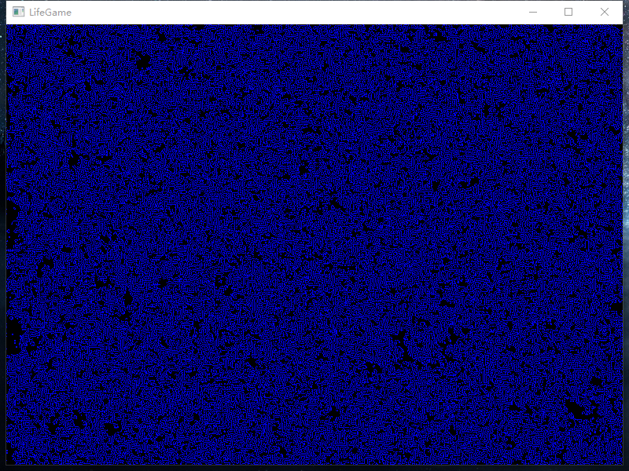

# life-game

一款用C++开发的[生命游戏](https://baike.baidu.com/item/%E7%94%9F%E5%91%BD%E6%B8%B8%E6%88%8F/2926434)。

只使用了标准Windows GUI库，没有使用任何第三方图形库。

这是我2006年9月开发完成的。

## 编译方法

用Visual Studio打开`LifeGame.sln`，根据VS的版本自动转换后，直接编译即可。

## 游戏方法

没有操作功能。
